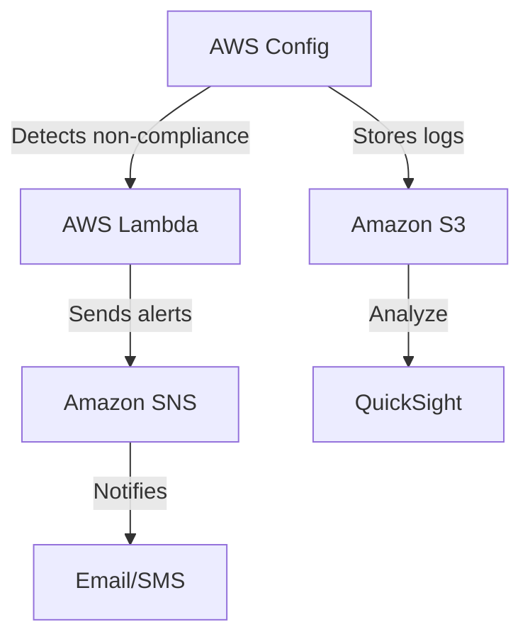

# Automated Security Compliance Monitoring with AWS Config & Lambda


A serverless solution to automatically monitor AWS resource compliance against security benchmarks (CIS, HIPAA, etc.) and receive real-time alerts.

## Features

- 🛡️ Continuous compliance monitoring using AWS Config
- 🔔 Real-time alerts via Amazon SNS (email/SMS)
- 📊 Optional visualization with QuickSight
- ⚡ Serverless architecture (Lambda)
- 🔄 Automated remediation capabilities

## Architecture



## Prerequisites

- AWS account with admin permissions
- AWS CLI configured
- Python 3.8+
- Basic understanding of AWS services

## Setup Guide

### 1. Enable AWS Config
```bash
aws configservice subscribe --s3-bucket YOUR_BUCKET_NAME
```

### 2. Deploy Lambda Function
```bash
cd lambda
pip install -r requirements.txt -t .
zip -r ../compliance-alert.zip .
aws lambda create-function \
    --function-name ComplianceAlertHandler \
    --runtime python3.9 \
    --handler lambda_function.lambda_handler \
    --role arn:aws:iam::123456789012:role/lambda-execution-role \
    --zip-file fileb://compliance-alert.zip
```

### 3. Configure SNS Alerts
```bash
aws sns create-topic --name ComplianceAlerts
aws sns subscribe \
    --topic-arn arn:aws:sns:us-east-1:123456789012:ComplianceAlerts \
    --protocol email \
    --notification-endpoint your.email@example.com
```

## Configuration

| Environment Variable | Description | Example |
|----------------------|-------------|---------|
| `SNS_TOPIC_ARN` | SNS Topic for alerts | `arn:aws:sns:us-east-1:123456789012:ComplianceAlerts` |
| `MIN_SEVERITY` | Minimum severity for alerts | `HIGH` |


## Troubleshooting

**No alerts received?**
1. Check Lambda CloudWatch logs
2. Verify SNS subscription is confirmed
3. Test with forced violation:
```python
# In Lambda code:
sns.publish(TopicArn=os.environ['SNS_TOPIC_ARN'], 
           Message="TEST", 
           Subject="Test Alert")
```

## License

[MIT](https://choosealicense.com/licenses/mit/)
```
