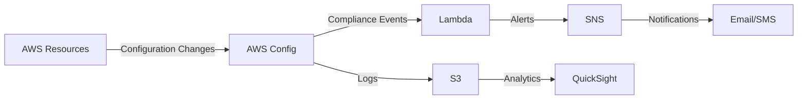

# Automated AWS Compliance Monitoring with Real-Time Alerts 🛡️


**This project automates security compliance monitoring** by configuring AWS Config to evaluate resources against security best practices (like CIS AWS Foundations Benchmark) and triggers Lambda-powered alerts via Amazon SNS when non-compliant resources are detected.



## Key Features ✨
- Continuous compliance monitoring against **CIS, HIPAA, PCI** standards
- Real-time alerts via **email/SMS** when violations occur
- **Visual dashboard** for compliance trends (QuickSight)
- **100% AWS Console** implementation (GUI-focused)
- Cost-optimized with free tier options

## GUI Setup Guide 🖥️

### 1. Enable AWS Config
(https://console.aws.amazon.com/config)
1. Open **AWS Config Console**
2. Click "Get started"
3. Configure:
   - ✅ Record **All resources**
   - 🗄️ Create S3 bucket for logs
   - 👔 Create IAM role automatically

### 2. Add Compliance Rules

```bash
CIS Rules to Enable:
- s3-bucket-public-read-prohibited
- iam-password-policy 
- vpc-default-security-group-closed
```

### 3. Create Alert System
| Component | Screenshot | Action |
|-----------|------------|--------|
| **SNS Topic** |  | 1. Create topic<br>2. Subscribe email |
| **Lambda** |  | Deploy [this Python code](#lambda-code) |

### 4. Connect Components

1. In AWS Config Rules
2. Select rule → **Actions** → **Manage remediation**
3. Choose your Lambda function

---

## Project Description 📝
This solution implements automated security governance by:
1. **Continuously monitoring** AWS resource configurations
2. **Evaluating compliance** against industry benchmarks
3. **Alerting security teams** in real-time via multiple channels
4. **Maintaining audit trails** in S3 for compliance reporting

**Supported Standards:**
- CIS AWS Foundations Benchmark v1.4
- AWS Foundational Security Best Practices
- Custom organizational policies


---

## Technical Details ⚙️
<details>
<summary>🔽 Lambda Code (Python)</summary>

```python
import boto3, os

def lambda_handler(event, context):
    config = boto3.client('config')
    sns = boto3.client('sns')
    
    # Get non-compliant resources
    violations = config.get_compliance_details_by_config_rule(
        ConfigRuleName=event['configRuleName'],
        ComplianceTypes=['NON_COMPLIANT']
    )
    
    if violations['EvaluationResults']:
        alert_message = f"""
        🚨 AWS Compliance Alert 🚨
        Rule: {event['configRuleName']}
        Account: {event.get('accountId', 'N/A')}
        Violations: {len(violations['EvaluationResults']}
        """
        sns.publish(
            TopicArn=os.environ['SNS_TOPIC'],
            Message=alert_message,
            Subject=f"AWS Compliance Alert: {event['configRuleName']}"
        )
```
</details>

---

## Cost Optimization 💰


**Free Tier Tips:**
- Use 2 Config rules max
- Limit S3 storage to 5GB
- 1 SNS topic with email only
- Disable global resource recording

```

