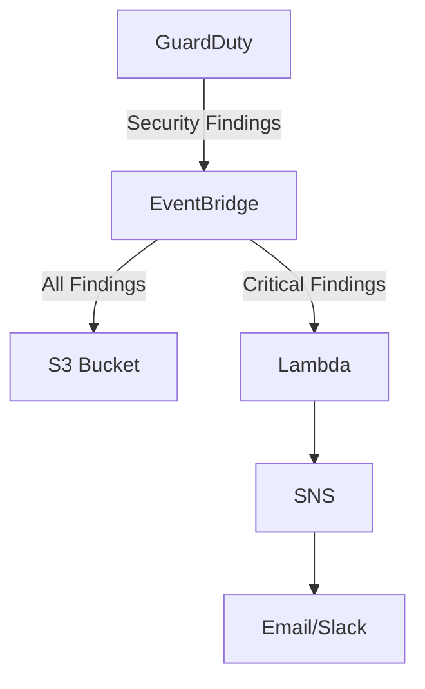

markdown
# Multi-Account Threat Detection with AWS GuardDuty

 
 


A centralized security monitoring solution that uses AWS GuardDuty, EventBridge, Lambda, and SNS to detect and alert on threats across multiple AWS accounts.

## 📌 Features

- **Centralized threat detection** across multiple AWS accounts
- **Automated alerts** for high-severity findings via email/Slack
- **Long-term log storage** in S3 for compliance
- **Cost-optimized** using AWS Free Tier eligible services
- **Real-time response** to security incidents

# Multi-Account Threat Detection with AWS GuardDuty

 
 


## Architecture



## Prerequisites
- AWS Account(s) with admin permissions
- AWS CLI configured (for optional testing)
- Email address or Slack webhook for alerts

## Deployment Steps

### 1. Enable GuardDuty in Master Account
```bash
aws guardduty create-detector --enable
```

### 2. Configure EventBridge Rule
1. Navigate to [Amazon EventBridge](https://console.aws.amazon.com/events/)
2. Create rule with pattern:
```json
{
  "source": ["aws.guardduty"],
  "detail-type": ["GuardDuty Finding"]
}
```

### 3. Set Up Alerts
1. Create SNS topic
2. Deploy Lambda function with provided Python code
3. Subscribe your email/Slack to SNS


## Testing
Simulate threats to verify detection:
```bash
# SSH brute force simulation
for i in {1..10}; do
  ssh -o StrictHostKeyChecking=no -o ConnectTimeout=1 fakeuser@YOUR_EC2_IP
done

# Suspicious API calls
aws iam list-users --region us-east-1
aws s3api list-buckets --region eu-west-1
```

## License
This project is licensed under the MIT License - see the [LICENSE](LICENSE) file for details.


