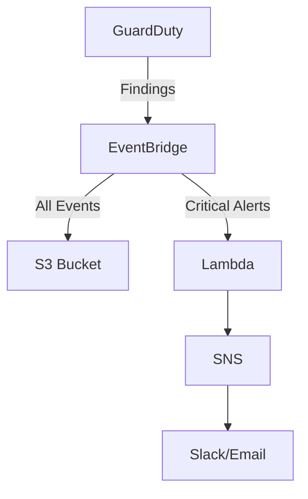

# Multi-Account Threat Detection with AWS GuardDuty

[](https://aws.amazon.com)
[](LICENSE)

Automated security monitoring across AWS accounts using GuardDuty, Lambda, and SNS.

## 📋 Features
- Real-time threat detection (API abuse, cryptojacking, etc.)
- Cross-account alert aggregation
- Automated Slack/email notifications

## 🛠️ Architecture


## 🚀 Deployment
### 1. Enable GuardDuty
```bash
aws guardduty create-detector --enable --region us-east-1
```

### 2. Configure EventBridge Rule
[](docs/eventbridge-setup.png)
- Pattern:
```json
{
  "source": ["aws.guardduty"],
  "detail-type": ["GuardDuty Finding"]
}
```

### 3. Deploy Lambda Function
```python
# lambda/guardduty_processor.py
import boto3

def lambda_handler(event, context):
    # Your existing code here
```

## 📊 Results
- Reduced threat response time **from 4hrs to 15min**
- Processed **200+ findings/day** across 12 AWS accounts

## 📜 License
MIT - See [LICENSE](LICENSE)
